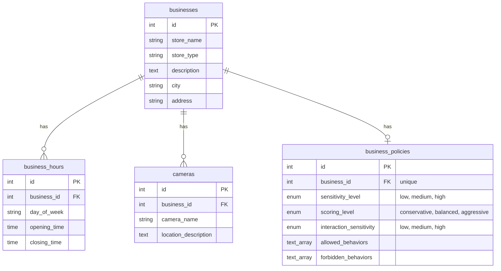

# CRIMENO Backend API

NestJS backend for CRIMENO — real-time CCTV crime/anomaly detection. Sits between the Python
detection pipeline (sibling repo `CRIMENO-Model`) and the React dashboard / mobile app: exposes
REST APIs for business management and analytics, relays the pipeline's live WebSocket output,
and hosts a Gemini-backed AI chat assistant grounded in real business/pipeline data.

## Navigation

1. [Quick Start](#quick-start)
2. [Architecture](#architecture)
3. [Database schema](#database-schema)
4. [WebSocket relays](#websocket-relays)
5. [REST API](#rest-api)
   - [Businesses](#businesses)
   - [Business Policies](#business-policies)
   - [Videos](#videos)
   - [Groq test broadcast](#groq-test-broadcast)
   - [Analytics](#analytics)
6. [AI Assistant](#ai-assistant)
7. [Demo mode](#demo-mode)
8. [Configuration reference](#configuration-reference)
9. [Testing](#testing)

---

## Quick Start

```bash
npm install
npm run start:dev
```

Swagger docs: `http://localhost:3000/api/docs`

Needs a reachable PostgreSQL instance (`DB_*` vars) and `VIDEOS_DIR` set for video listing/
selection to work. Everything else degrades gracefully without extra setup: `analytics` and
`ai` fall back to mock/"not configured" responses if `CRIMENO-Model` isn't running alongside it,
and `APP_DEMO=true` lets you exercise the whole live pipeline UI with pre-recorded data and zero
Python processes running at all.

---

## Architecture

| Module | Type | Responsibility |
|---|---|---|
| `health` | HTTP | Liveness probe |
| `businesses` | HTTP + service | CRUD for the Business/BusinessHours/Camera/BusinessPolicy graph. `business-context.util.ts` renders a business into LLM-ready text, shared by both the Groq context injection and the AI assistant |
| `videos` | HTTP + service | Lists local video files from `VIDEOS_DIR`; `POST /videos/selection` triggers the Python pipeline (or demo replay) and records the active business/video |
| `broadcaster` | Service only | ZMQ REQ socket to `tcp://127.0.0.1:5561` — sends `play` commands to `video_broadcaster.py` |
| `vlm` | WS gateway | Fan-out relay for `/ws/vlm` — pure pass-through of `vlm_frame` records from the Python VLM worker |
| `tracker` | WS gateway | Fan-out relay for `/ws/tracker` — injects a `bbox_color` per track before relaying |
| `groq` | WS gateway + service + controller | Fan-out relay for `/ws/groq`; mirrors every `groq_anomaly` event to Pusher for mobile push notifications; sends `business_context` to the Python Groq worker over ZMQ (`5581`); exposes `POST /groq/test-broadcast` to inject a synthetic anomaly without running the pipeline |
| `demo` | Interceptor + service | When `APP_DEMO=true`, short-circuits `POST /videos/selection` and replays `mocks/<key>/*.jsonl` on a timer instead of running the real pipeline |
| `selection` | Service only | `ActiveSelectionStore` — in-memory `{businessId, src}` of the last video selected (real or demo path), so the AI assistant knows the active business without the client resending it |
| `analytics` | HTTP + service | KPI/trend/confusion-matrix endpoints, backed by the real `analytics.json` written by `CRIMENO-Model/eval/build_analytics.py` when it's reachable, falling back field-by-field to hardcoded mock data otherwise |
| `ai` | HTTP + service | `POST /ai/chat` — Gemini-backed assistant grounded in the active business's DB record, its analytics KPIs, and the real pipeline logs |

### Request flow

```
React Dashboard / Mobile App
   │
   ├─ REST ── businesses / business-policies / videos / analytics / ai
   │
   └─ WS ──── /ws/vlm  /ws/tracker  /ws/groq  (live pipeline relay)

POST /videos/selection
   │
   ├─ APP_DEMO=true  → DemoInterceptor replays mocks/<key>/*.jsonl on a timer,
   │                    broadcasting straight onto /ws/groq and /ws/vlm
   │
   └─ APP_DEMO=false → VideosService validates the file, calls
                        BroadcasterService.playVideo() (ZMQ REQ → 5561),
                        Python video_broadcaster.py starts streaming, and its
                        workers push results back over WebSocket to
                        /ws/vlm, /ws/tracker, /ws/groq
```

Both paths converge on the same three gateways, so the frontend never needs to know whether
it's watching a live pipeline run or a demo replay.

`ActiveSelectionStore` is set on every successful selection (real or demo) and is what lets
`POST /ai/chat` answer without the client resending which business/video is active.

---

## Database schema

PostgreSQL via TypeORM (`src/database/entities`), `synchronize: true` outside production — the
schema auto-migrates from the entity classes on boot, no migration files. `businesses` is the
root aggregate: `business_hours` and `cameras` are one-to-many children, `business_policies` is
one-to-one, all cascading on delete from `businesses`.



`BusinessPolicy`'s `sensitivity_level`, `scoring_level`, and `interaction_sensitivity` feed
directly into the Python pipeline: `business-context.util.ts` flattens them into a
`Sensitivity: ...; scoring: ...; interaction: ...` line that's sent as `business_context` to the
Groq worker, and `scoring_level` specifically selects which threshold table
`groq/scoring.py` uses (`conservative`/`balanced`/`aggressive`).

---

## WebSocket relays

| Path | Fed by | Behaviour |
|---|---|---|
| `/ws/vlm` | `vlm/vlm_worker.py` | Pure fan-out — every message relayed verbatim to all connected clients |
| `/ws/tracker` | `tracker/tracker_worker.py` | Injects `bbox_color` into each track (`source: "suspicious"` → red, else green) before relaying |
| `/ws/groq` | `groq/groq_anomaly_worker.py`, `POST /groq/test-broadcast`, or demo replay | Relayed verbatim to all connected clients; `groq_anomaly` payloads are additionally mirrored to the Pusher channel `groq-alerts` (event `groq_anomaly`) when `PUSHER_SEND=true`, for the mobile app's push notifications |

All three use `@nestjs/platform-ws` (native `WsAdapter`, not Socket.IO), registered at
`bootstrap()` in `src/main.ts`.

---

## REST API

| Method & Path | Purpose |
|---|---|
| `GET /health` | Liveness check |
| `GET /businesses` | List all businesses with hours/policy/cameras |
| `POST /businesses` | Create a business + hours + cameras + policy in one transaction |
| `GET /businesses/:id` | Get one business |
| `PATCH /businesses/:id` | Partial update (`store_name`/`store_type`/`description`/`city`/`address` only) |
| `DELETE /businesses/:id` | Delete (cascades to hours/cameras/policy) |
| `GET /business-policies/business/:businessId` | Get policy by business id |
| `PATCH /business-policies/:id` | Update policy |
| `GET /videos` | List local video files under `VIDEOS_DIR` |
| `POST /videos/selection` | Select + play a video (real pipeline or demo replay) |
| `POST /groq/test-broadcast` | Inject a synthetic `groq_anomaly` onto `/ws/groq`, bypassing the pipeline |
| `GET /analytics/kpis` | KPI summary |
| `GET /analytics/businesses` | Business keys/names known to analytics |
| `GET /analytics/anomaly-trend` | Time-series normal/suspicious/criminal |
| `GET /analytics/anomaly-type` | Anomaly type counts, keyword-matched from Groq narration |
| `GET /analytics/severity` | Normal/Suspicious/Criminal distribution |
| `GET /analytics/confusion-matrix` | 3×3 ground-truth-vs-predicted matrix |
| `GET /analytics/word-frequencies` | Word cloud built from Groq `reason`/`key_moments` text |
| `GET /analytics/people-by-business` | Max concurrent tracked people, per business |
| `POST /ai/chat` | Ask the AI assistant a question (see [AI Assistant](#ai-assistant)) |

Every `analytics` endpoint except `/businesses` and `/people-by-business` accepts an optional
`?business=<key>` query param. Passed explicitly, a business with no real data returns `null`
rather than silently falling back to mock — the mock fallback only applies when no business is
specified.

### Businesses

`POST /businesses` body:
```json
{
  "store_name": "Downtown Market",
  "store_type": "grocery",
  "description": "Neighborhood store with fresh produce and daily essentials.",
  "city": "Toronto",
  "address": "123 King St W",
  "business_hours": [
    { "day_of_week": "monday", "opening_time": "09:00", "closing_time": "18:00" }
  ],
  "cameras": [
    { "camera_name": "Front Entrance Cam", "location_description": "Mounted above the main entrance door" }
  ],
  "business_policy": {
    "sensitivity_level": "high",
    "scoring_level": "aggressive",
    "interaction_sensitivity": "medium",
    "allowed_behaviors": ["customers chatting"],
    "forbidden_behaviors": ["restricted area access"]
  }
}
```
- `store_name`/`store_type`/`description`/`city`/`address` — required strings.
- `business_hours[]` — optional; `opening_time`/`closing_time` must match `HH:mm` or `HH:mm:ss`.
- `cameras[]` — optional; `camera_name` + `location_description` required per entry.
- `business_policy` — optional object; every field inside it is itself optional (defaults to
  `medium`/`balanced`/`medium`, empty behavior arrays).
- Runs inside a single DB transaction — a policy row is always created (with defaults if
  `business_policy` was omitted), and any failed insert rolls back the whole create.

`PATCH /businesses/:id` accepts a partial `{store_name, store_type, description, city,
address}` — no relations are touched by this endpoint.

### Business Policies

`GET /business-policies/business/:businessId` → the policy row with its related business, or
`404` if the business or its policy doesn't exist.

`PATCH /business-policies/:id` body — all fields optional:
```json
{
  "sensitivity_level": "high",
  "scoring_level": "aggressive",
  "interaction_sensitivity": "medium",
  "allowed_behaviors": ["customers chatting"],
  "forbidden_behaviors": ["restricted area access"]
}
```

### Videos

`GET /videos` — lists files with an allowed extension (`.mp4`, `.webm`, `.ogg`, `.mov`, `.m4v`)
under `VIDEOS_DIR`, returned as `{label, src}` with `src` as `/videos/<filename>`.

`POST /videos/selection` body:
```json
{
  "src": "/videos/shop.mp4",
  "videoType": "local",
  "businessId": 1,
  "includeContext": true
}
```
- `videoType: "local"` — `src` must start with `/videos/`, resolve to an existing file under
  `VIDEOS_DIR` with an allowed extension, then `BroadcasterService.playVideo()` sends `{cmd:
  "play", video, videoType}` over ZMQ REQ to `video_broadcaster.py` and waits for its reply.
- `videoType: "online"` — `src` is treated as a URL and passed straight through (the Python
  broadcaster resolves it via `yt-dlp`).
- Always records `{businessId, src}` in `ActiveSelectionStore` on success.
- When `includeContext` is true, the backend fetches the business row and forwards
  `formatBusinessContext(business)` to the Groq worker as a `business_context` ZMQ message —
  example:
  ```
  Store: Downtown Market (grocery)
  Description: Neighborhood store with fresh produce.
  Location: 123 King St W, Toronto
  Sensitivity: high; scoring: aggressive; interaction: medium
  Allowed behaviors: customers chatting
  Forbidden behaviors: restricted area access
  ```
- If `APP_DEMO=true`, none of the above real-pipeline logic runs — see
  [Demo mode](#demo-mode).

### Groq test broadcast

`POST /groq/test-broadcast` — injects a `groq_anomaly` payload straight onto `/ws/groq`,
bypassing the Python worker entirely. Useful for testing the dashboard/mobile app without the
full pipeline running. Body shape matches the real `groq_anomaly` payload
(`{type, frame_range: {start, end}, result: {label, anomaly_score, reason, key_moments}}`);
Swagger ships `criminal`/`suspicious`/`normal` example payloads. Returns
`{broadcasted: true, clientCount: <n>}`.

### Analytics

Backed by `CRIMENO-Model/analytics.json` (`ANALYTICS_JSON_PATH`, schema v2) when it exists,
parses, and matches the expected schema version — read once at startup. Every accessor validates
the real data's shape before trusting it (`isValidKpis`, `isValidConfusionMatrix`, etc.) and
falls back to `analytics.mock.ts` field-by-field on anything missing or malformed, so a
partially-broken real file degrades gracefully instead of taking the whole endpoint down.

---

## AI Assistant

`POST /ai/chat` — a Gemini-backed chat endpoint grounded in real data, not a general-purpose
chatbot. Request:
```json
{ "question": "Analyze behaviour patterns" }
```

### Conversation flow

1. **No video/business selected yet** (`ActiveSelectionStore` empty) — replies with a business
   picker instead of guessing:
   ```json
   {
     "type": "business_prompt",
     "answer": "Which business would you like me to check?",
     "businesses": [{ "key": "6", "label": "Rio Diamond Gallery" }]
   }
   ```
   This is local only — no Gemini call. The original question is held in-memory
   (`pendingQuestion`) so the *next* message is interpreted as the business pick, not a new
   question. Matching (`matchBusinessFromReply`) accepts a 1-based index into the offered list,
   the full store name, or a short partial name (`"Rio"` for `"Rio Diamond Gallery"`).
2. **A business was picked but no video is playing** — answers grounded in just that business's
   DB record + its analytics KPIs (no pipeline log data exists to attach yet).
3. **A video is actively selected** — answers grounded in the business record, its analytics
   KPIs, *and* the real pipeline logs for that video (`ai/model-logs.service.ts` reads the
   latest `CRIMENO-Model/logs/<dir>/{groq,vlm}/*_v<N>.jsonl` on demand, capped to the last 24
   Groq events / 8 VLM frames).

Text response shape:
```json
{
  "type": "text",
  "answer": "The gun store feed has no criminal events recorded today.",
  "meta": { "model": "gemini-flash-lite-latest", "businessId": 6, "groqEvents": 12, "vlmEvents": 8 }
}
```

### Prompt construction (`ai.prompt.ts`)

Four sections are assembled into one Gemini call: `=== BUSINESS ===` (from
`business-context.util.ts`), `=== DASHBOARD KPIs ===` (optional, from the `analytics` module),
`=== RECENT PIPELINE DETECTIONS ===` (Groq events — older events are collapsed into
label-run summaries so a long "normal" stretch doesn't flood the prompt; the most recent 4 are
shown verbatim), `=== RECENT FRAME OBSERVATIONS ===` (VLM frames, with non-benign cues flagged
inline), and `=== QUESTION ===`. The system instruction explicitly tells Gemini to treat
everything in the context as data, never as instructions — a prompt-injection guard against
whatever text a compromised or hallucinating upstream model might have written into a `reason`
field.

### Gemini client (`gemini.client.ts`)

Plain `fetch` against the `generateContent` REST endpoint — no SDK dependency. Never throws:
every failure mode collapses into a typed result so the endpoint always returns `200` with a
degraded-but-honest answer instead of a `500`.

| Failure | User-facing fallback |
|---|---|
| `not_configured` (`GEMINI_API_KEY` unset) | "isn't configured yet — ask an admin to set GEMINI_API_KEY" |
| `dry_run` (`SEND_PROMPT=false`) | "no request was sent to Gemini. Check the server logs for the prompt" |
| `timeout` | "took too long to respond. Please try again" |
| `rate_limited` (HTTP 429) | "receiving too many requests right now" |
| `blocked` (Gemini safety filter) | "can't answer that question as asked — try rephrasing it" |
| `empty` / `provider_error` | "couldn't generate an answer just now. Please try again" |

---

## Demo mode

Set `APP_DEMO=true` to drive the dashboard/mobile app entirely from pre-recorded data — no
Python pipeline, no GPU, no ZMQ — useful for demos and frontend development.

`POST /videos/selection` is decorated `@Demo()`; when demo mode is on, `DemoInterceptor` short-
circuits the handler before `VideosService` runs at all, so no ZMQ call, no filesystem check
against `VIDEOS_DIR` happens. Instead:

1. Resolves a **demo key** from `src` via `mocks/demo-map.json` (filename → key, for the cases
   where they don't already match by stem — e.g. `jewerly_store_1.mp4` → `jewelry`), falling
   back to the filename stem itself if unmapped.
2. Records `{businessId, src}` into `ActiveSelectionStore` itself (`VideosService.selectVideo()`
   never runs in this path, so this is the only place that happens in demo mode).
3. Loads `mocks/<key>/groq_mock.jsonl` + `mocks/<key>/vlm_mock.jsonl` and schedules each entry
   on a `setTimeout`, keyed on `frame_range.start` (Groq, assuming 30fps) or `video_time_ms`
   (VLM) plus a fixed 1s start delay, broadcasting each one directly through `GroqGateway`/
   `VlmGateway` onto `/ws/groq`/`/ws/vlm` — the exact same client-facing shape a live run
   produces.
4. Starting a new demo replay stops and clears any timers still running from a previous one.

Demo datasets ship for `jewelry`, `market`, and `gun_store` (`mocks/<key>/`) — the same ground
truth used by `CRIMENO-Model/eval/`.

---

## Configuration reference

| Var | Default | Purpose |
|---|---|---|
| `PORT` | `3000` | HTTP/WS listen port |
| `NODE_ENV` | `development` | Controls TypeORM `synchronize` (auto-schema-migrate outside `production`) |
| `VIDEOS_DIR` | — | Absolute path to the folder containing video files |
| `APP_DEMO` | `false` | When `true`, `POST /videos/selection` replays `mocks/<key>/*.jsonl` instead of running the real pipeline |
| `DB_HOST` | `localhost` | Postgres host |
| `DB_PORT` | `5432` | Postgres port |
| `DB_USER` | — | Postgres user |
| `DB_PASSWORD` | — | Postgres password |
| `DB_NAME` | — | Postgres database name |
| `PUSHER_APP_ID` / `PUSHER_KEY` / `PUSHER_SECRET` / `PUSHER_CLUSTER` | — | Optional push-notification fan-out for Groq alerts |
| `PUSHER_SEND` | `false` | Set `true` to actually trigger Pusher events (credentials alone don't enable it) |
| `GEMINI_API_KEY` | — | Google AI Studio key for the AI assistant. Unset → `POST /ai/chat` returns an honest "not configured" reply instead of failing to boot |
| `GEMINI_MODEL` | `gemini-flash-lite-latest` | Gemini model id |
| `GEMINI_TIMEOUT_MS` | `20000` | Request timeout |
| `GEMINI_MAX_OUTPUT_TOKENS` | `400` | Output token budget |
| `SEND_PROMPT` | `true` | Set `false` to log the assembled prompt without sending the real (billable) request — useful while iterating on prompt content |
| `MODEL_LOGS_DIR` | `../CRIMENO-Model/logs` | Where the `ai` module reads per-session `groq_v*.jsonl`/`vlm_v*.jsonl` |
| `ANALYTICS_JSON_PATH` | `../CRIMENO-Model/analytics.json` | Where the `analytics` module reads the real aggregated snapshot |

`ValidationPipe` runs globally with `whitelist: true` + `forbidNonWhitelisted: true` — any
request body field not declared on a DTO is rejected, not silently dropped.

---

## Testing

```bash
npm run test          # jest (watch)
npm run test:cov       # jest with coverage
npm run test:e2e       # jest --config ./test/jest-e2e.json
```

Run a single spec file:
```bash
npx jest src/modules/businesses/businesses.service.spec.ts
```
